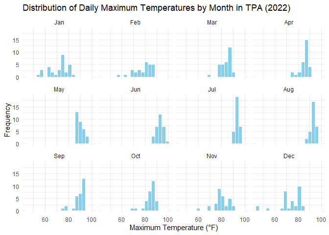
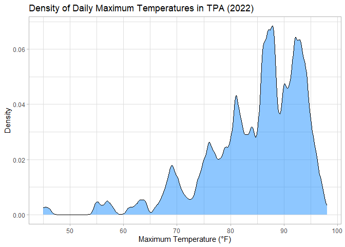
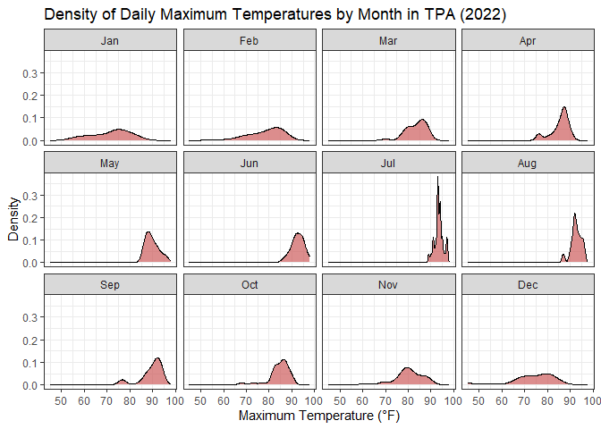
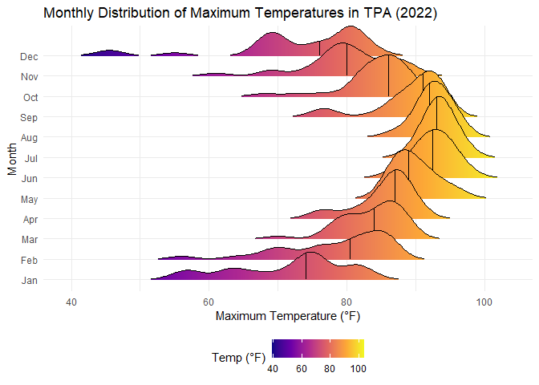
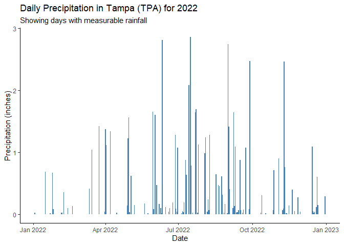
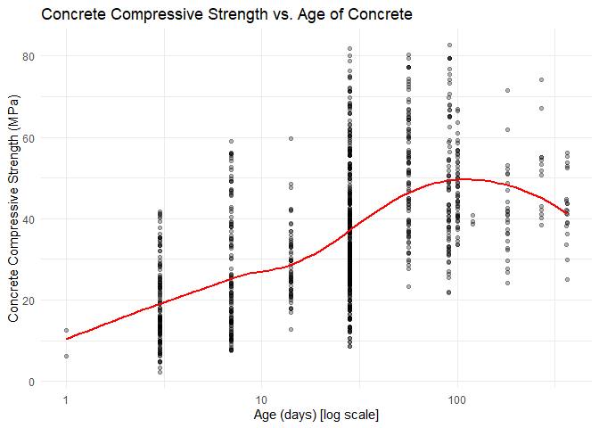
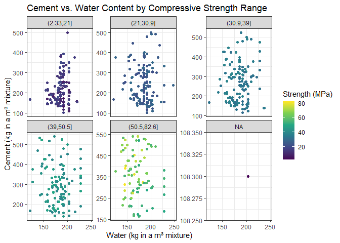

# Data Visualization Project 03


In this exercise you will explore methods to create different types of data visualizations (such as plotting text data, or exploring the distributions of continuous variables).


## PART 1: Density Plots

Using the dataset obtained from FSU's [Florida Climate Center](https://climatecenter.fsu.edu/climate-data-access-tools/downloadable-data), for a station at Tampa International Airport (TPA) for 2022, attempt to recreate the charts shown below which were generated using data from 2016. You can read the 2022 dataset using the code below: 


``` r
library(tidyverse)
library(lubridate)
library(ggridges)
weather_tpa <- read_csv("https://raw.githubusercontent.com/aalhamadani/datasets/master/tpa_weather_2022.csv")
# random sample 
sample_n(weather_tpa, 4)
```

```
## # A tibble: 4 × 7
##    year month   day precipitation max_temp min_temp ave_temp
##   <dbl> <dbl> <dbl>         <dbl>    <dbl>    <dbl>    <dbl>
## 1  2022     5    24          0.01       94       79     86.5
## 2  2022    10    16          0          90       71     80.5
## 3  2022    12     3          0          82       63     72.5
## 4  2022    10    12          0.02       85       74     79.5
```

See Slides from Week 4 of Visualizing Relationships and Models (slide 10) for a reminder on how to use this type of dataset with the `lubridate` package for dates and times (example included in the slides uses data from 2016).

Using the 2022 data: 

(a) Create a plot like the one below:


``` r
# (a) Create a faceted histogram of maximum temperatures
library(lubridate)
library(ggridges)
# Create a 'Date' column and an ordered, abbreviated 'month_name' column.
weather_tpa <- weather_tpa %>%
  mutate(
    Date = make_date(year, month, day),
    month_name = month(Date, label = TRUE, abbr = TRUE)
  )

# Replace missing value placeholders with NA using the correct column names
weather_tpa <- weather_tpa %>%
  mutate(
    max_temp = na_if(max_temp, -99.9),
    min_temp = na_if(min_temp, -99.9),
    precipitation = na_if(precipitation, -99.99)
  )
```


``` r
# (a) Create a faceted histogram of maximum temperatures
ggplot(weather_tpa, aes(x = max_temp)) +
  geom_histogram(binwidth = 3, fill = "skyblue", color = "white") +
  facet_wrap(~ month_name) +
  labs(
    title = "Distribution of Daily Maximum Temperatures by Month in TPA (2022)",
    x = "Maximum Temperature (°F)",
    y = "Frequency"
  ) +
  theme_minimal()
```

<!-- -->
Hint: the option `binwidth = 3` was used with the `geom_histogram()` function.

(b) Create a plot like the one below:


``` r
# (b) Create a density plot of maximum temperatures
ggplot(weather_tpa, aes(x = max_temp)) +
  geom_density(kernel = "gaussian", bw = 0.5, fill = "dodgerblue", alpha = 0.5) +
  labs(
    title = "Density of Daily Maximum Temperatures in TPA (2022)",
    x = "Maximum Temperature (°F)",
    y = "Density"
  ) +
  theme_light()
```

<!-- -->
Hint: check the `kernel` parameter of the `geom_density()` function, and use `bw = 0.5`.

(c) Create a plot like the one below:


``` r
# (c) Create a faceted density plot of maximum temperatures
ggplot(weather_tpa, aes(x = max_temp)) +
  geom_density(fill = "indianred", alpha = 0.7) +
  facet_wrap(~ month_name) +
  labs(
    title = "Density of Daily Maximum Temperatures by Month in TPA (2022)",
    x = "Maximum Temperature (°F)",
    y = "Density"
  ) +
  theme_bw()
```

<!-- -->
Hint: default options for `geom_density()` were used. 

(d) Generate a plot like the chart below:


``` r
# (d) Create a ridgeline plot of maximum temperatures
ggplot(weather_tpa, aes(x = max_temp, y = month_name, fill = after_stat(x))) +
  geom_density_ridges_gradient(
    quantile_lines = TRUE,
    quantiles = 2,
    scale = 3,
    rel_min_height = 0.01
  ) +
  scale_fill_viridis_c(name = "Temp (°F)", option = "plasma") +
  labs(
    title = "Monthly Distribution of Maximum Temperatures in TPA (2022)",
    x = "Maximum Temperature (°F)",
    y = "Month"
  ) +
  theme_minimal() +
  theme(legend.position = "bottom")
```

```
## Picking joint bandwidth of 1.93
```

<!-- -->

Hint: use the`{ggridges}` package, and the `geom_density_ridges()` function paying close attention to the `quantile_lines` and `quantiles` parameters. The plot above uses the `plasma` option (color scale) for the _viridis_ palette.


(e) Create a plot of your choice that uses the attribute for precipitation _(values of -99.9 for temperature or -99.99 for precipitation represent missing data)_.
Custom Plot: Daily Precipitation Time Series


``` r
# (e) Create a plot using the precipitation attribute
# Filtering out days with no or trace precipitation for clarity
prcp_data <- weather_tpa %>%
  filter(precipitation > 0)

ggplot(prcp_data, aes(x = Date, y = precipitation)) +
  geom_bar(stat = "identity", fill = "steelblue") +
  labs(
    title = "Daily Precipitation in Tampa (TPA) for 2022",
    subtitle = "Showing days with measurable rainfall",
    x = "Date",
    y = "Precipitation (inches)"
  ) +
  theme_classic()
```

<!-- -->


## PART 2 

> **You can choose to work on either Option (A) or Option (B)**. Remove from this template the option you decided not to work on. 

### Option (B): Data on Concrete Strength 

Concrete is the most important material in **civil engineering**. The concrete compressive strength is a highly nonlinear function of _age_ and _ingredients_. The dataset used here is from the [UCI Machine Learning Repository](https://archive.ics.uci.edu/ml/index.php), and it contains 1030 observations with 9 different attributes 9 (8 quantitative input variables, and 1 quantitative output variable). A data dictionary is included below: 


Variable                      |    Notes                
------------------------------|-------------------------------------------
Cement                        | kg in a $m^3$ mixture             
Blast Furnace Slag            | kg in a $m^3$ mixture  
Fly Ash                       | kg in a $m^3$ mixture             
Water                         | kg in a $m^3$ mixture              
Superplasticizer              | kg in a $m^3$ mixture
Coarse Aggregate              | kg in a $m^3$ mixture
Fine Aggregate                | kg in a $m^3$ mixture      
Age                           | in days                                             
Concrete compressive strength | MPa, megapascals


Below we read the `.csv` file using `readr::read_csv()` (the `readr` package is part of the `tidyverse`)


``` r
concrete <- read_csv("../data/concrete.csv", col_types = cols())
```


Let us create a new attribute for visualization purposes, `strength_range`: 


``` r
new_concrete <- concrete %>%
  mutate(strength_range = cut(Concrete_compressive_strength, 
                              breaks = quantile(Concrete_compressive_strength, 
                                                probs = seq(0, 1, 0.2))) )
```


1. Explore the distribution of 2 of the continuous variables available in the dataset. Do ranges make sense? Comment on your findings.

Yes. Standard structural concrete typically uses between 300 to 450 kg of cement per cubic meter. The lower values (around 100-200 kg/m³) are plausible for lean concrete mixes, while the upper values (>500 kg/m³) are characteristic of high-performance or high-strength concrete. The range observed in the data is therefore realistic and covers a wide variety of concrete types.

2. Use a _temporal_ indicator such as the one available in the variable `Age` (measured in days). Generate a plot similar to the one shown below. Comment on your results.


``` r
# Code to generate the described plot
ggplot(concrete, aes(x = Age, y = `Concrete_compressive_strength`)) +
  geom_point(alpha = 0.3) +
  geom_smooth(method = "loess", color = "red", se = FALSE) +
  scale_x_log10() +
  labs(
    title = "Concrete Compressive Strength vs. Age of Concrete",
    x = "Age (days) [log scale]",
    y = "Concrete Compressive Strength (MPa)"
  ) +
  theme_minimal()
```

```
## `geom_smooth()` using formula = 'y ~ x'
```

<!-- -->

The plot shows an unmistakable positive correlation: as the age of the concrete increases, its compressive strength also increases. The upward slope of the red trend line confirms this.

This visualization perfectly captures a fundamental property of concrete: it doesn't gain strength linearly but follows a curve of diminishing returns. This is precisely the behavior expected in civil engineering applications.

3. Create a scatterplot similar to the one shown below. Pay special attention to which variables are being mapped to specific aesthetics of the plot. Comment on your results. 


``` r
# Code to generate the described plot
ggplot(new_concrete, aes(x = Water, y = Cement)) +
  geom_point(aes(color = `Concrete_compressive_strength`)) +
  facet_wrap(~ strength_range, scales = "free_y") +
  scale_color_viridis_c() +
  labs(
    title = "Cement vs. Water Content by Compressive Strength Range",
    x = "Water (kg in a m³ mixture)",
    y = "Cement (kg in a m³ mixture)",
    color = "Strength (MPa)"
  ) +
  theme_bw()
```

<!-- -->

This plot is a visual representation of the most critical principle in concrete mix design: the water-to-cement ratio. A lower ratio generally leads to higher strength.

The primary story is told by comparing the five plots (facets) from left to right, which correspond to increasing strength ranges.In the lowest-strength category, the data points are clustered in a region of lower cement content and a wide range of water content. In the highest-strength category, the data points have clearly shifted upwards and to the left. This means these mixes use a high amount of cement and a low amount of water.

This faceted plot successfully deconstructs the relationship between the ingredients and the outcome. It clearly demonstrates that to produce stronger concrete, one must use a richer mix—one that contains more cement and less water.
